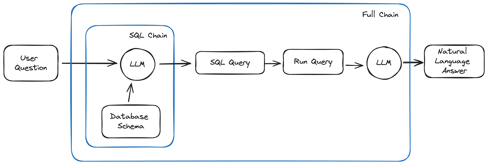

# MySQL Python Chatbot with GPT-4 and Mistral AI

Welcome to the GitHub repository for our tutorial on building a natural language SQL chatbot using GPT-4! This project guides you through the development of a chatbot that can interpret natural language queries, generate SQL queries, and fetch results from a SQL database, all in an intuitive and user-friendly way. It utilizes the power of OpenAI's GPT-4 model, integrated with a Streamlit GUI for an enhanced interaction experience.

🟡 This repository serves as supporting material for the [YouTube video tutorial](https://youtu.be/YqqRkuizNN4).

## Features
- **Natural Language Processing**: Uses GPT-4 to interpret and respond to user queries in natural language.
- **SQL Query Generation**: Dynamically generates SQL queries based on the user's natural language input.
- **Database Interaction**: Connects to a SQL database to retrieve query results, demonstrating practical database interaction.
- **Streamlit GUI**: Features a user-friendly interface built with Streamlit, making it easy for users of all skill levels.
- **Python-based**: Entirely coded in Python, showcasing best practices in software development with modern technologies.

## Brief Explanation of How the Chatbot Works

The chatbot works by taking a user's natural language query, converting it into a SQL query using GPT-4, executing the query on a SQL database, and then presenting the results back to the user in natural language. This process involves several steps of data processing and interaction with the OpenAI API and a SQL database, all seamlessly integrated into a Streamlit application.

Consider the following diagram to understand how the different chains and components are built:



For a more detailed explanation and a step-by-step guide, refer this other video: [YouTube video tutorial](https://youtu.be/9ccl1_Wu24Q).

For a more detailed explanation and a step-by-step guide, refer to the [YouTube video tutorial](Chat with MySQL Database with Python | LangChain Tutorial).

## Installation
Ensure you have Python installed on your machine. Then clone this repository:

```bash
git clone [repository-link]
cd [repository-directory]
```

Install the required packages:

```bash
pip install -r requirements.txt
```

Create your own .env file with the necessary variables, including your OpenAI API key:

```bash
OPENAI_API_KEY=[your-openai-api-key]
```

## Usage
To launch the Streamlit app and interact with the chatbot:

```bash
streamlit run app.py
```

## Contributing
As this repository accompanies the [YouTube video tutorial](https://youtu.be/YqqRkuizNN4), we are primarily focused on providing a comprehensive learning experience. Contributions for bug fixes or typos are welcome.

## License
This project is licensed under the MIT License - see the LICENSE file for details.

---

**Note**: This project is intended for educational and research purposes. Please ensure compliance with the terms of use and guidelines of any APIs or services used.

---

We hope this repository aids in your exploration of integrating AI with web technologies. For more informative tutorials, be sure to check out [Your YouTube Channel].

Happy Coding! 🚀👨‍💻🤖

---

*If you find this project helpful, please consider giving it a star!*

---
